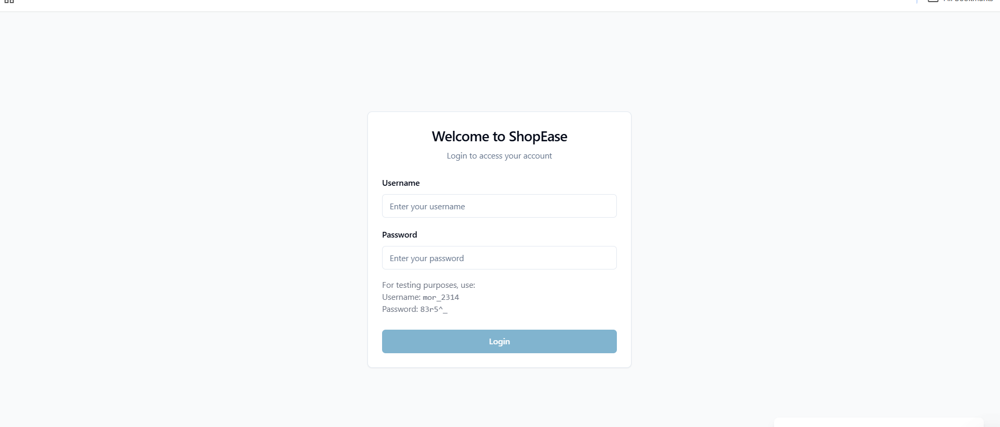
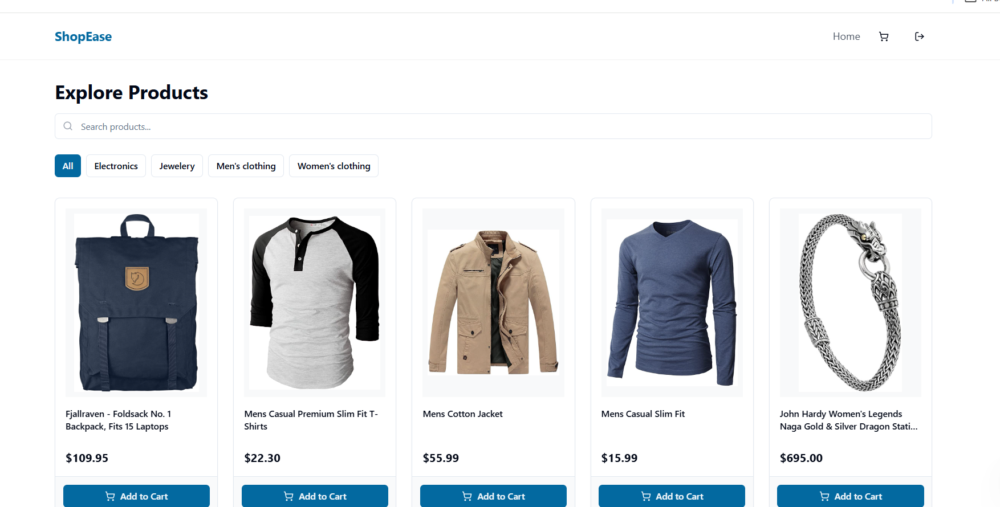
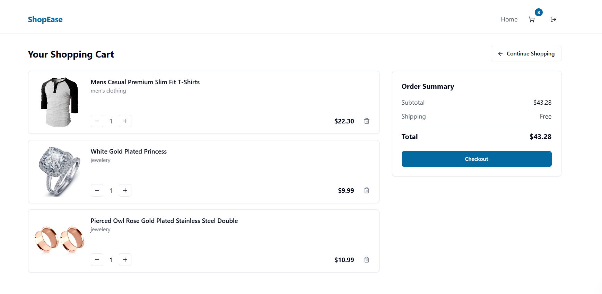

# 🛍️ Shopping Website - Frontend Internship Assignment

This is a fully responsive **Shopping Website** built using **React.js** and the [Fake Store API](https://fakestoreapi.com/). It includes authentication, product browsing, cart management, and checkout functionality — all created as part of a Front-End Internship Assignment.

---

## 🚀 Live Demo

🌐 [View Live on Netlify](https://shop-easy-frontend-dun.vercel.app)  
📂 [GitHub Repository](https://github.com/Vija047/shop-easy-frontend)

---

## 📌 Features

### ✅ Authentication
- Login with username and password using `/auth/login`
- Stores JWT token securely in `localStorage`
- Redirects to product listing on successful login
- Logout clears token and redirects to login

### 🛒 Product Listing
- Fetches products from `/products`
- Responsive grid layout (mobile-first)
- Filter by category using `/products/category/:category`
- Optional: Search bar for product titles

### 📦 Product Detail Page
- Detailed product view with image, title, description, and price
- "Add to Cart" functionality

### 🧺 Cart Page
- View and update quantity of cart items
- Remove items from cart
- Displays total price
- "Checkout" button clears cart and shows a success popup for 4 seconds

### 🔗 Navigation Header
- Links to **Home**, **Cart**, and **Logout**
- Dynamic cart item count
- Logout clears token and redirects to login

---

## 🛠️ Tech Stack

- **React.js** (Vite or CRA)
- **React Router v6+**
- **React Hooks**
- **Context API** (for global cart state)
- **CSS** (Mobile-first responsive design)
- **Fake Store API** - [https://fakestoreapi.com](https://fakestoreapi.com)

---

